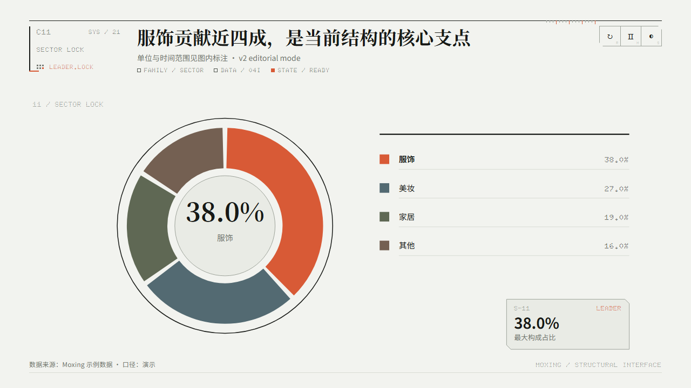

# Moxing Studio v2

Moxing Studio 把中文商业、金融和分析数据生成具有结构装配动画的离线 HTML/SVG 图表。它不是一组 PPT 主题，而是一套统一的 **Structural Interface / 结构接口**：数据先对齐基准、装配构件、接通关系，最后锁定结论。

[在线查看 24 款动态图表](https://halexzd686-cloud.github.io/moxing-studio/) · [下载 v2.0.2](https://github.com/halexzd686-cloud/moxing-studio/releases/tag/v2.0.2) · [图表数据契约](references/chart-contracts.md)

[](https://halexzd686-cloud.github.io/moxing-studio/)

## Why Moxing

- 建筑秩序主导，东方当代气质来自比例、留白和中文排版。
- 动画遵循 `ALIGN → DOCK → ROUTE → LOCK`，解释数据关系而非装饰画面。
- `brief / standard / story` 是三套独立时间轴，不是简单倍速。
- 无 JavaScript 或启用减少动态效果时，直接显示完整静态终态。
- 冷白工程纸与深色仪器面板共享同一结构身份。
- 不依赖 CDN 或在线图表库，字体与许可证随仓库提供。

## Install as a Codex Skill

[OpenAI 官方资料](https://developers.openai.com/codex/use-cases?category=engineering&task_type=workflow)将 Skill 定义为 Codex 可重复使用的工作流。Moxing Studio 的 `SKILL.md` 位于仓库根目录，安装后可以自动匹配图表任务，也可以用 `$moxing-studio` 显式调用。

### 方法一：让 Codex 安装

在 Codex 中发送：

```text
使用 $skill-installer 从 https://github.com/halexzd686-cloud/moxing-studio 安装仓库根目录的 moxing-studio Skill
```

安装完成后，在下一轮对话或新任务中使用。

### 方法二：手动安装（PowerShell）

```powershell
$skillHome = if ($env:CODEX_HOME) {
  Join-Path $env:CODEX_HOME "skills"
} else {
  Join-Path ([Environment]::GetFolderPath("UserProfile")) ".codex\skills"
}

New-Item -ItemType Directory -Force -Path $skillHome | Out-Null
git clone --branch v2.0.2 --depth 1 `
  https://github.com/halexzd686-cloud/moxing-studio.git `
  (Join-Path $skillHome "moxing-studio")
```

升级已有安装：

```powershell
git -C (Join-Path $skillHome "moxing-studio") pull --ff-only
```

## Use in Codex

可以直接描述目标，让 Codex 自动选择本 Skill；需要明确指定时使用 `$moxing-studio`。

```text
使用 $moxing-studio，把下面的商品销售额生成 C13 帕累托图。
标题要直接写出前三个 SKU 的贡献结论，输出可离线发送的 HTML，并导出 PNG。

SKU-A 286
SKU-B 214
SKU-C 156
SKU-D 102
SKU-E 74
```

也可以要求 Codex 先选择图表：

```text
使用 $moxing-studio 分析这份经营数据。先比较最合适的两个图表契约，说明取舍，再生成最终图表。
```

Skill 会优先根据数据形状和决策问题选择 C1–C24，并保留单位、时间范围、口径和来源。详细边界见 [Chart Contracts](references/chart-contracts.md)。

## Use from the command line

生成 HTML 只需要 **Python 3.10+**，不需要安装第三方 Python 包。

```powershell
git clone https://github.com/halexzd686-cloud/moxing-studio.git
Set-Location moxing-studio

python scripts/export_examples.py
python scripts/render.py `
  --chart C13 `
  --data examples/data/c13-pareto-contribution.json `
  --output output/c13-pareto.html `
  --title "前三款商品贡献近四分之三，应优先保障供给" `
  --subtitle "单位：万元 · 2026 年 1–6 月" `
  --footer "数据来源：商品经营系统 · 口径：支付金额"
```

默认输出会嵌入字体，是可以单独移动和发送的单文件 HTML。只有当输出文件继续保持在仓库约定目录中时，才使用 `--linked-fonts` 减少文件体积。

批量重建所有模板与 Gallery：

```powershell
python scripts/build_templates.py
python scripts/build_gallery.py
```

打开 `templates/gallery.html` 即可离线查看全部图表。24 份可复制数据位于 [`examples/data/`](examples/data/)，可用 `scripts/export_examples.py` 随默认数据重新生成。

## Export PNG and motion

PNG 导出会优先使用 Python Playwright，未安装时自动尝试本机 Chrome 或 Edge：

```powershell
python scripts/export.py output/c13-pareto.html output/c13-pareto.png
```

WebM 动画使用仓库的 Node 依赖：

```powershell
npm install
npx playwright install chromium ffmpeg
node scripts/export-motion.mjs output/c13-pareto.html output/c13-pareto.webm standard
```

支持 `brief / standard / story`。MP4/GIF 还需要系统 `ffmpeg`；未安装时优先交付 WebM。PNG 固定导出为 `2560×1440`。

## Charts

| Domain | IDs | Contracts |
|---|---|---|
| Foundation | C1–C10 | Structural Rank、Ranked Rail、Signal Trend、Composition Field、Composition Bands、Ledger Steps、Milestone Lanes、Stage Channel、Metric Lockup、Decision Interface |
| Commerce | C11–C16 | Sector Lock、Metric Small Multiples、Pareto Contribution、Cohort Matrix、Commerce Flow、Decision Bubble Matrix |
| Finance | C17–C20 | Market Candles、Performance Drawdown、Yield Curve、Sensitivity Matrix |
| Analysis | C21–C24 | Distribution Profile、Correlation Matrix、Forecast Fan、Control Chart |

## Validation

```powershell
python -m pip install -r requirements-dev.txt
python scripts/validate_skill.py
python scripts/validate_presentation_modes.py
python scripts/validate_presentation_carriers.py
python scripts/test_boundaries.py

npm install
npx playwright install chromium
node scripts/validate.mjs .
```

当前基线：展示模式映射 `13/13`、三载体与 A+B 组迁移 `16/16`、边界渲染 `103/103`，浏览器、静态降级、动效与布局检查 `256/256`。其中包含 10 张 Direct Canvas 的三宏层帧预算、9 张 Embedded Evidence 的四宏层帧预算、24 张图的证据—关键图形碰撞扫描，以及浅色/深色双表面的填充数据标签对比度检查；GitHub Actions 会在每次推送和 Pull Request 中重新执行这些检查。

## Contributing

新增公开图表 ID 前，必须证明它解决了现有契约无法诚实表达的行业决策问题；视觉变体应优先实现为 preset。开发流程、测试要求和图表准入标准见 [CONTRIBUTING.md](CONTRIBUTING.md)。

## Fonts and licensing

仓库包含经过常用字符压缩的 Noto Sans SC、Noto Serif SC 和 Doto WOFF2。字体遵循 SIL Open Font License，许可证位于 `assets/fonts/`。

项目代码使用 [MIT License](LICENSE)。v1 完整版本保存在 Git 标签 `v1.0`，主分支不重复维护旧模板和旧主题。
