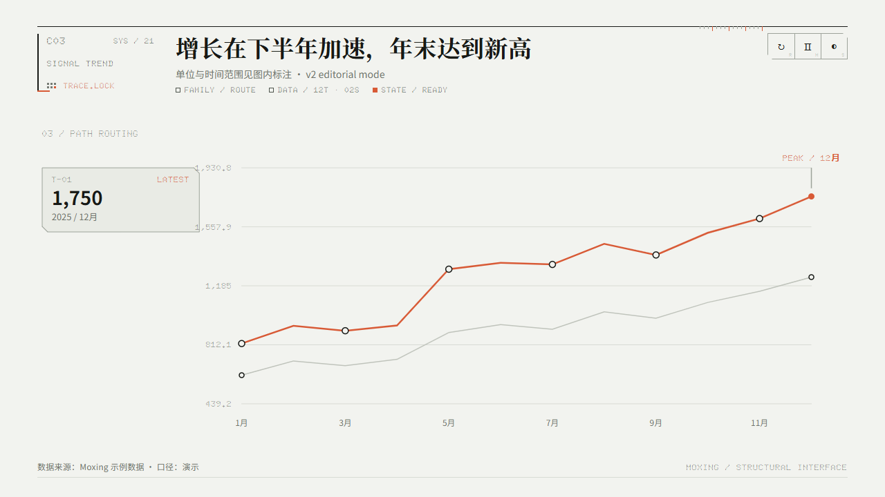
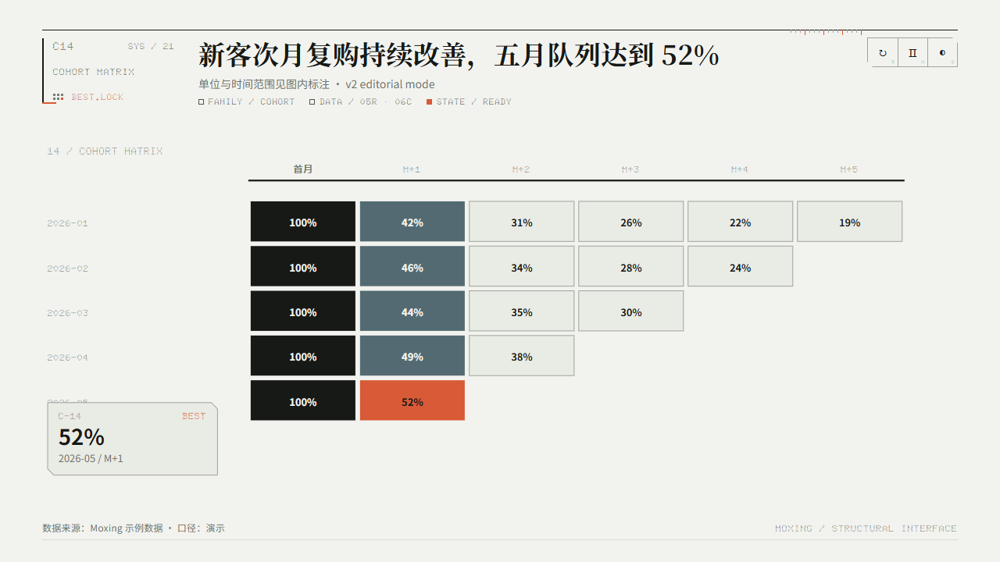
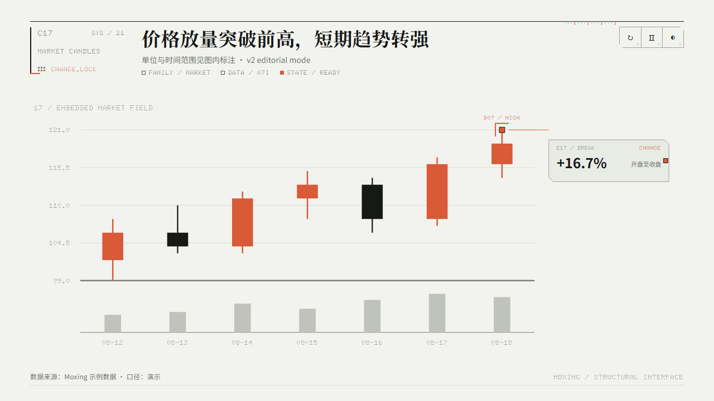
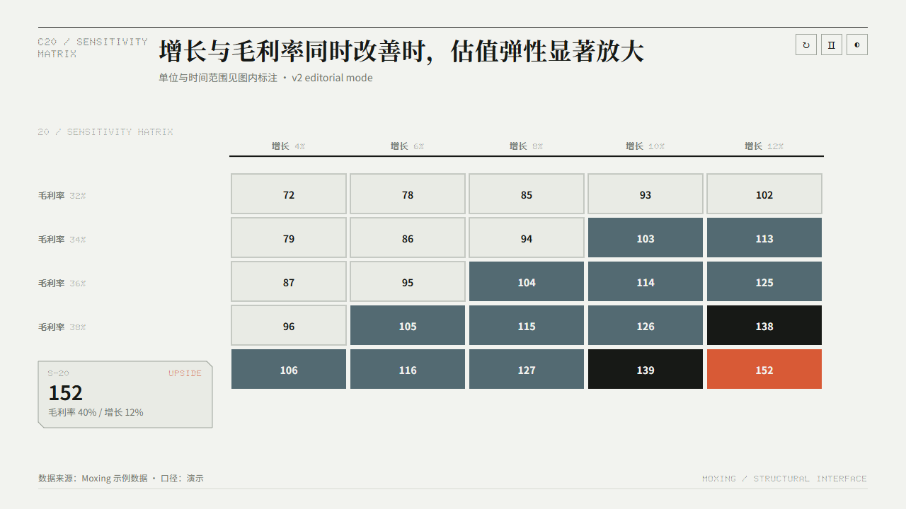
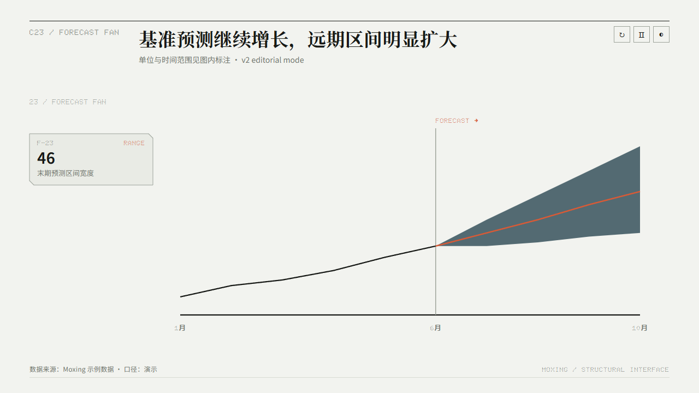

# Moxing Studio v2.1 — Structural Charts for AI Agents

把商业、金融和分析数据变成**一页一个判断**的结构动画图表。24 个受测试保护的数据契约，完全离线的 HTML/SVG，以及在静态截图中仍然成立的结论终态。

[在线体验 24 款动态图表](https://halexzd686-cloud.github.io/moxing-studio/) · [60 秒开始](#60-秒开始) · [按场景选图](#按场景快速选图表) · [下载 v2.1.0](https://github.com/halexzd686-cloud/moxing-studio/releases/tag/v2.1.0)

<table>
  <tr>
    <td width="33%"><a href="https://halexzd686-cloud.github.io/moxing-studio/"></a></td>
    <td width="33%"><a href="https://halexzd686-cloud.github.io/moxing-studio/"></a></td>
    <td width="33%"><a href="https://halexzd686-cloud.github.io/moxing-studio/"></a></td>
  </tr>
  <tr>
    <td width="33%"><a href="https://halexzd686-cloud.github.io/moxing-studio/"></a></td>
    <td width="33%"><a href="https://halexzd686-cloud.github.io/moxing-studio/"></a></td>
    <td width="33%"><a href="https://halexzd686-cloud.github.io/moxing-studio/"></a></td>
  </tr>
</table>

## Why Moxing

- **结构，而非装饰。** 动画遵循 `ALIGN → DOCK → ROUTE → LOCK`，用装配过程解释数据关系。
- **契约，而非模板碰运气。** Agent 先判断问题和数据形状，再从 C1–C24 选择不会歪曲结论的表达。
- **交付，而非只能在线演示。** HTML、字体和图表逻辑自包含，不依赖 CDN 或在线图表库。
- **终态先成立。** 无 JavaScript、关闭动画或启用减少动态效果时，直接显示完整静态结论。
- **一套结构身份。** 冷白工程纸与深色仪器面板共享比例、中文排版和信息层级。
- **可验证。** 边界数据、展示模式、动画状态、桌面与移动 Gallery 都进入自动测试。

Moxing 适合经营复盘、管理层汇报、投研、路演和网页数据故事。它不追求通用 Dashboard 控件、任意拖拽排版或装饰性信息海报；当数据口径不完整时，Agent 应先提问，而不是猜数字。

## 60 秒开始

### 1. 让 Codex 安装

```text
使用 $skill-installer 从 https://github.com/halexzd686-cloud/moxing-studio
安装仓库根目录的 moxing-studio Skill。安装后读取 SKILL.md。
```

### 2. 直接描述你要做的判断

```text
使用 $moxing-studio，把这份销售数据做成一张适合经营复盘的图表。
先比较两个最合适的图表契约，说明取舍，再输出可离线发送的 HTML 和 PNG。
保留单位、时间范围、指标口径和数据来源。
```

把 CSV、JSON、表格文本或文件一起交给 Agent 即可。不确定 Cxx ID、A/B/C 展示模式或动画时长时，让 Skill 自动选择。

### 3. 试试这些请求

```text
比较这几个投资组合的收益和回撤，突出风险收益不匹配的部分。
```

```text
把项目里程碑做成一张适合管理层周会展示的动态图，15 秒内能找到延期阶段。
```

```text
分析这份商品数据，找出贡献最高的 SKU，并判断长尾是否值得继续保留。
```

```text
我不知道该用哪种图。先比较两个最合适的契约，以及它们各自会强调和隐藏什么。
```

### 4. 你会得到什么

- 自包含的离线 HTML/SVG，以及需要时导出的 PNG 或 WebM。
- 直接写出判断的中文标题，以及单位、时间范围、来源和口径。
- 与结论结构匹配的 A / B / C 展示模式和 `brief / standard / story` 动画时间轴。
- JavaScript 不可用时仍然完整可读的静态终态。

## 三种阅读方式

| 用户需要 | 常见展示方式 | 画面如何组织 |
|---|---|---|
| 一眼读取排名、异常或结论 | A · Direct Canvas | 结论直接存在于数据场中，不额外拆出证据面板 |
| 同时看主图与局部证据 | B · Embedded Evidence | 在图内自然留白中嵌入解释，不牺牲主图宽度 |
| 看清推导过程与结论锁定 | C · Evidence Interface | 用独立证据仓、终端和目标锁定呈现推导链 |

这是常见映射，不是硬绑定。A / B / C 决定信息如何组织；`brief / standard / story` 决定动画叙述节奏，两者相互独立。

## 安装 Skill

[OpenAI 官方资料](https://developers.openai.com/codex/use-cases?category=engineering&task_type=workflow)将 Skill 定义为 Codex 可重复使用的工作流。Moxing Studio 的 `SKILL.md` 位于仓库根目录，安装后可以自动匹配图表任务，也可以用 `$moxing-studio` 显式调用。

### 方法一：让 Codex 安装（推荐）

在 Codex 中发送：

```text
使用 $skill-installer 从 https://github.com/halexzd686-cloud/moxing-studio 安装仓库根目录的 moxing-studio Skill
```

安装完成后，在下一轮对话或新任务中使用。

### 方法二：手动安装（PowerShell）

```powershell
$skillHome = if ($env:CODEX_HOME) {
  Join-Path $env:CODEX_HOME "skills"
} else {
  Join-Path ([Environment]::GetFolderPath("UserProfile")) ".codex\skills"
}

New-Item -ItemType Directory -Force -Path $skillHome | Out-Null
git clone --branch v2.1.0 --depth 1 `
  https://github.com/halexzd686-cloud/moxing-studio.git `
  (Join-Path $skillHome "moxing-studio")
```

升级已有安装：

```powershell
git -C (Join-Path $skillHome "moxing-studio") pull --ff-only
```

### 安装后验证

```text
检查 moxing-studio 是否已安装；读取它的 SKILL.md；
先不要生成图表，列出它支持的 24 个图表 ID、适用场景和三种动画模式。
```

如果 Agent 没有识别 Skill，先在同一条请求中显式写 `$moxing-studio`，再继续给数据。

## 如何调用

### 推荐请求格式

| 字段 | 应该写什么 | 示例 |
|---|---|---|
| 目标 | 想做出的业务判断 | 找出贡献最高的 SKU |
| 数据 | CSV、JSON、表格文本或文件路径 | `SKU-A,286` |
| 单位/时间范围 | 数字的单位和观察区间 | 万元 · 2026 年 1–6 月 |
| 口径/来源 | 指标如何计算、来自哪里 | 支付金额 · 商品经营系统 |
| 输出 | HTML、PNG、WebM 及动画模式 | HTML + PNG，`standard` |

字段越完整，Agent 越不需要猜测；如果数据字段与契约不匹配，请让 Agent 先指出缺口，再决定是否补充数据。默认让 Skill 自动选择展示模式和动画；只有在你有明确的汇报节奏或画面用途时才指定它们。

### 可直接复制的请求

```text
使用 $moxing-studio，把下面的商品销售额生成 C13 帕累托图。
标题要直接写出前三个 SKU 的贡献结论，输出可离线发送的 HTML，并导出 PNG。

SKU-A 286
SKU-B 214
SKU-C 156
SKU-D 102
SKU-E 74
```

也可以要求 Codex 先选择图表：

```text
使用 $moxing-studio 分析这份经营数据。先比较最合适的两个图表契约，说明取舍，再生成最终图表。
```

Skill 会优先根据数据形状和决策问题选择 C1–C24，并保留单位、时间范围、口径和来源。详细边界见 [Chart Contracts](references/chart-contracts.md)。

## 生成、预览与导出

生成 HTML 只需要 **Python 3.10+**，不需要安装第三方 Python 包。

```powershell
git clone https://github.com/halexzd686-cloud/moxing-studio.git
Set-Location moxing-studio

python scripts/export_examples.py
python scripts/render.py `
  --chart C13 `
  --data examples/data/c13-pareto-contribution.json `
  --output output/c13-pareto.html `
  --title "前三款商品贡献近四分之三，应优先保障供给" `
  --subtitle "单位：万元 · 2026 年 1–6 月" `
  --footer "数据来源：商品经营系统 · 口径：支付金额"
```

默认输出会嵌入字体，是可以单独移动和发送的单文件 HTML。只有当输出文件继续保持在仓库约定目录中时，才使用 `--linked-fonts` 减少文件体积。

批量重建所有模板与 Gallery：

```powershell
python scripts/build_templates.py
python scripts/build_gallery.py
```

打开 `templates/gallery.html` 即可离线查看全部图表。桌面端使用双列 Gallery；900px 以下自动切换为单列锁定帧，最多保留 4 个邻近 iframe。点击 `OPEN` 后进入单图 Viewer：竖屏默认提供可左右滑动的细节视图，并可用 `FIT` 查看全图；横屏自动将 1280×720 画布铺满安全区域。任何时候只有聚焦图表会播放动画。

本机通过 HTTP 预览：

```powershell
python -m http.server 4400 --bind 127.0.0.1
```

然后打开 `http://127.0.0.1:4400/templates/gallery.html`。同一 Wi-Fi 下临时使用手机验收时，可将绑定地址改为 `0.0.0.0`，并用手机访问电脑局域网 IP；Windows 防火墙可能需要允许 Python 监听专用网络。不要把这一方式直接暴露到公网。

仓库的 GitHub Pages 工作流会在远程 `main` 更新后发布 `templates/` 与 `assets/`，永久入口为 `https://halexzd686-cloud.github.io/moxing-studio/`。分支中的改动在合并并推送前不会出现在该地址。

24 份可复制数据位于 [`examples/data/`](examples/data/)，可用 `scripts/export_examples.py` 随默认数据重新生成。

### 从示例数据开始

如果还没有自己的数据，先复制一个最接近的示例：

```powershell
Get-ChildItem examples/data
python scripts/export_examples.py
```

然后把示例 JSON 的字段替换成自己的数据，并把对应的 Cxx ID 告诉 Agent。每个 ID 的输入边界和必填字段见 [图表数据契约](references/chart-contracts.md)。

### 导出 PNG 和动画

PNG 导出会优先使用 Python Playwright，未安装时自动尝试本机 Chrome 或 Edge：

```powershell
python scripts/export.py output/c13-pareto.html output/c13-pareto.png
```

WebM 动画使用仓库的 Node 依赖：

```powershell
npm install
npx playwright install chromium ffmpeg
node scripts/export-motion.mjs output/c13-pareto.html output/c13-pareto.webm standard
```

支持 `brief / standard / story`。它们控制动画节奏，不改变图表契约。A / B / C 控制信息如何在画面中组织；需要手工指定时，在请求中同时写明两者。MP4/GIF 还需要系统 `ffmpeg`；未安装时优先交付 WebM。PNG 固定导出为 `2560×1440`。

## 按场景快速选图表

| 你要回答的问题 | 优先查看 |
|---|---|
| 排名、横向比较、决策结论 | C1、C2、C10 |
| 时间趋势、阶段变化、项目进度 | C3、C7、C8 |
| 构成、占比、贡献度 | C4、C5、C11、C13 |
| 漏斗、留存、商业流向 | C14、C15、C16 |
| 收益、回撤、利率、敏感性 | C17、C18、C19、C20 |
| 分布、相关性、预测、不确定性 | C21、C22、C23、C24 |

这张表只用于缩小范围；最终仍以数据形状和决策问题为准。需要精确边界时，直接让 Agent 先读取 [Chart Contracts](references/chart-contracts.md)。

## 常见问题

### Skill 没有自动触发

在请求开头写 `使用 $moxing-studio`。如果仍未触发，先执行“安装后验证”请求，确认 Agent 能读取根目录 `SKILL.md`。

### 图表类型拿不准

要求 Agent 先比较两个契约并说明取舍；不要只说“做一张好看的图”，否则数据关系和标题口径容易被误读。

### 动画需要更快、更慢或关闭

在输出要求中直接写 `brief`、`standard`、`story` 或“关闭动画”。无 JavaScript、浏览器启用减少动态效果时，图表仍会显示完整静态终态。

### 手机看不到 Gallery

不要用 `file://` 直接打开，先在仓库根目录启动 HTTP 服务，再用电脑局域网 IP 访问：

```powershell
python -m http.server 4400 --bind 0.0.0.0
```

手机竖屏优先进入单图 Viewer，使用 `FIT` 查看完整画布；横屏会自动铺满安全区域。

### 字体或导出结果不一致

确认输出没有使用 `--linked-fonts`，或把整个输出目录一起移动。默认导出会嵌入仓库提供的字体，适合离线发送。

## Charts

| Domain | IDs | Contracts |
|---|---|---|
| Foundation | C1–C10 | Structural Rank、Ranked Rail、Signal Trend、Composition Field、Composition Bands、Ledger Steps、Milestone Lanes、Stage Channel、Metric Lockup、Decision Interface |
| Commerce | C11–C16 | Sector Lock、Metric Small Multiples、Pareto Contribution、Cohort Matrix、Commerce Flow、Decision Bubble Matrix |
| Finance | C17–C20 | Market Candles、Performance Drawdown、Yield Curve、Sensitivity Matrix |
| Analysis | C21–C24 | Distribution Profile、Correlation Matrix、Forecast Fan、Control Chart |

## Validation

```powershell
python -m pip install -r requirements-dev.txt
python scripts/validate_skill.py
python scripts/validate_presentation_modes.py
python scripts/validate_presentation_carriers.py
python scripts/test_boundaries.py

npm install
npx playwright install chromium
node scripts/validate.mjs .
```

当前基线：展示模式映射 `14/14`、三载体契约 `21/21`、边界渲染 `103/103`。24 张图均已重建并通过 Gallery 桌面/移动入口检查，C3 与 C19 的终端标注也已完成缩放安全间距修正；GitHub Actions 会在每次推送和 Pull Request 中重新执行这些检查。

## Contributing

新增公开图表 ID 前，必须证明它解决了现有契约无法诚实表达的行业决策问题；视觉变体应优先实现为 preset。开发流程、测试要求和图表准入标准见 [CONTRIBUTING.md](CONTRIBUTING.md)。

## Fonts and licensing

仓库包含经过常用字符压缩的 Noto Sans SC、Noto Serif SC 和 Doto WOFF2。字体遵循 SIL Open Font License，许可证位于 `assets/fonts/`。

项目代码使用 [MIT License](LICENSE)。v1 完整版本保存在 Git 标签 `v1.0`，主分支不重复维护旧模板和旧主题。
