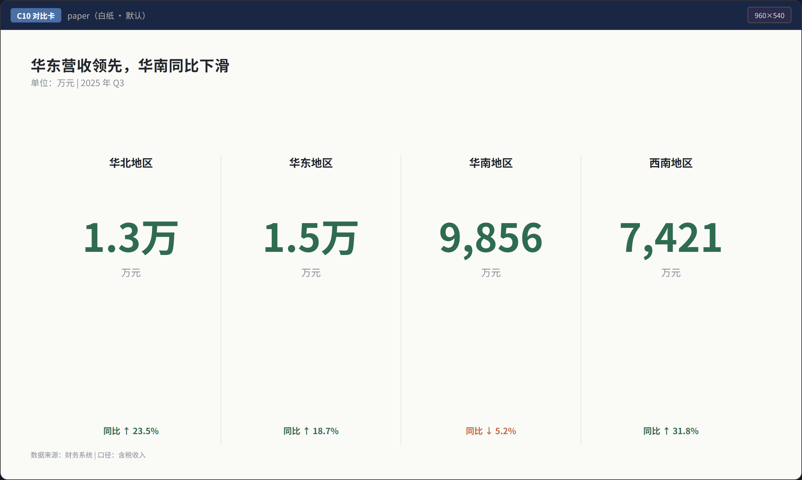
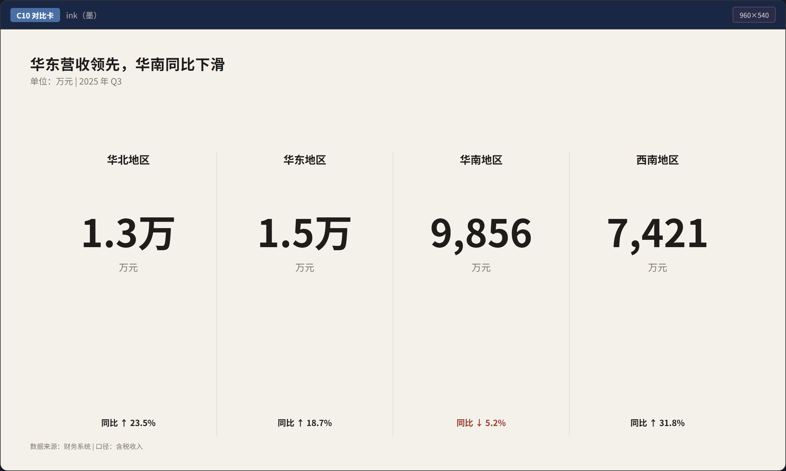
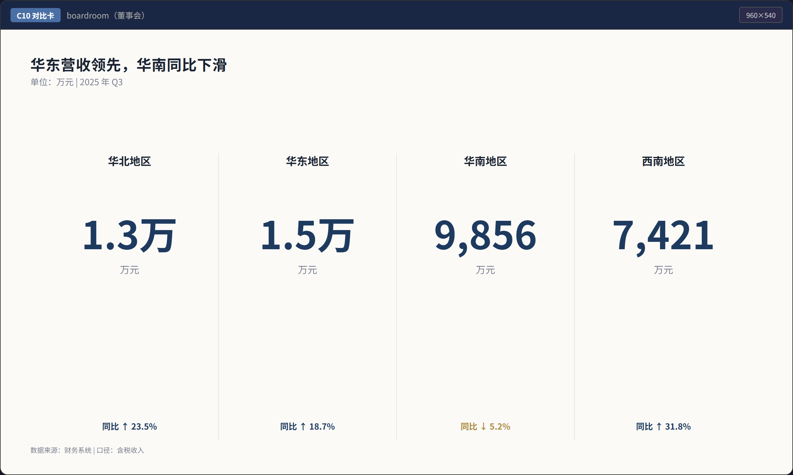
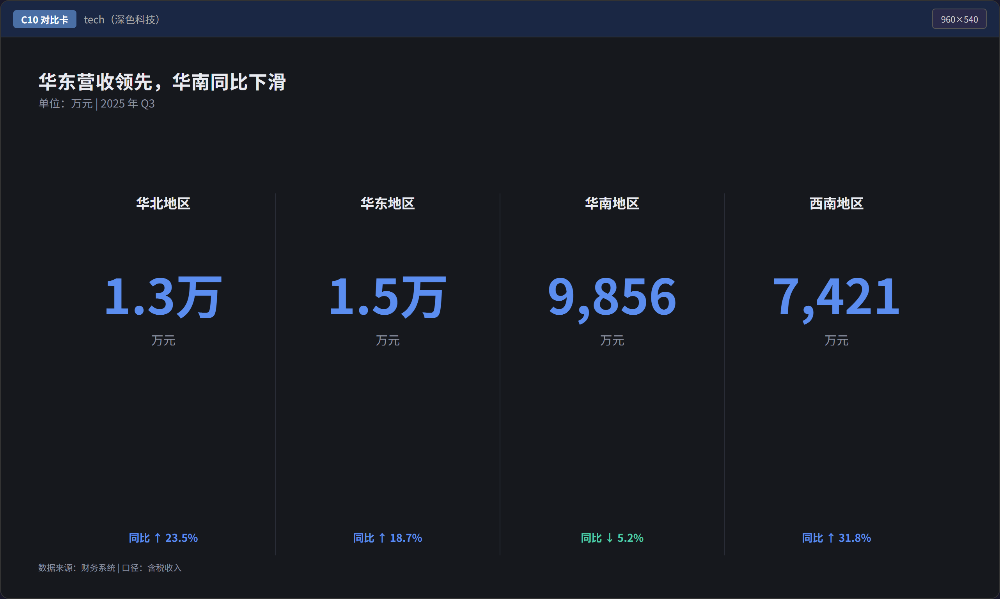
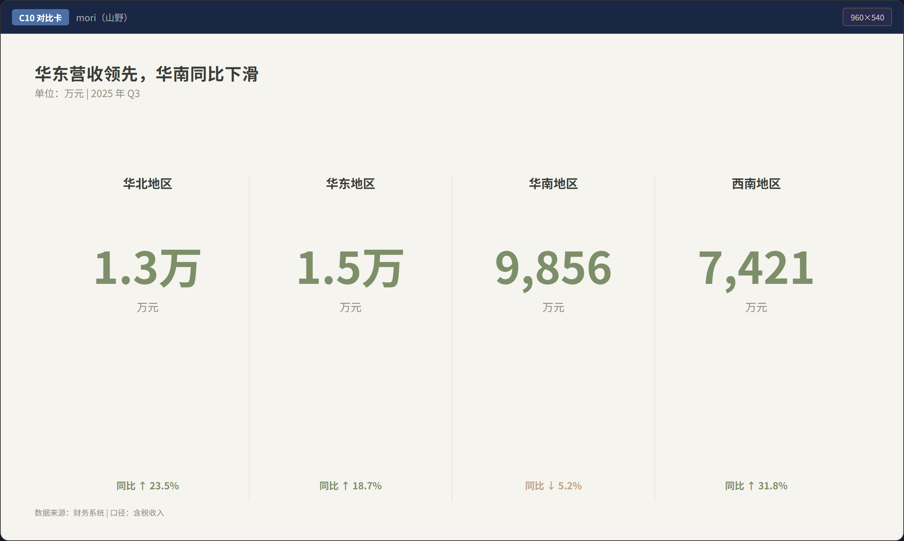
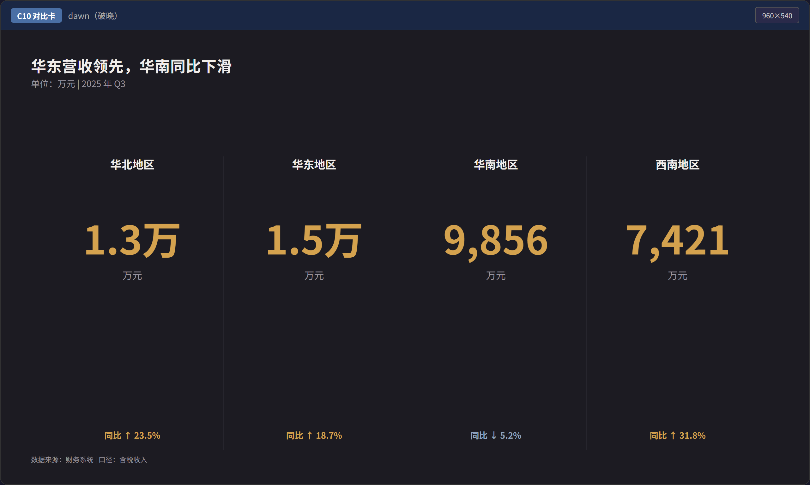

# Moxing Studio

Moxing Studio 是一个面向职场汇报的单页图表 Skill：输入数据，输出可直接投屏或贴入 PPT 的 `1280×720` 单文件 HTML 图表。

图表主体是内联静态 SVG。没有在线字体、外部图表库和运行时布局计算；即使禁用 JavaScript，图表仍然完整可见。

## 图型

| 编号 | 图型 | 适用数据 |
|---|---|---|
| C1 | 柱状图 | 少量类目比较 |
| C2 | 条形图 | 排名、长类目名 |
| C3 | 折线图 | 时间趋势，最多 4 条序列 |
| C4 | 环形图 | 最多 6 部分的占比构成 |
| C5 | 堆叠柱 | 构成 × 时间或类目 |
| C6 | 瀑布图 | 起点到终点的增减分解 |
| C7 | 甘特图 | 最多 10 个任务的项目排期 |
| C8 | 漏斗图 | 3–6 级阶段转化 |
| C9 | 指标卡 | 单个 KPI |
| C10 | 对比卡 | 2–4 个 KPI 并列比较 |

## 主题

内置 `paper`、`ink`、`boardroom`、`tech`、`mori`、`dawn` 六套主题。完整的 60 种组合可在 [验收画廊](templates/gallery.html) 中查看。

| paper | ink | boardroom |
|---|---|---|
|  |  |  |

| tech | mori | dawn |
|---|---|---|
|  |  |  |

## 使用

1. 根据 [SKILL.md](SKILL.md) 的数据形状决策树选择 C1–C10。
2. 复制 `templates/` 中对应模板，只替换数据、结论标题、单位、时间范围和来源。
3. 按 `SKILL.md` 的 11 条清单自检后交付 HTML。
4. 需要 PNG 时运行：

```powershell
python scripts/export.py templates/c10-compare.html output.png
```

导出脚本优先使用 Python Playwright；未安装时会自动尝试系统 Chrome 或 Edge。成功输出为 `2560×1440` PNG。

## 重新构建

项目构建阶段需要 Python 3，生成后的 HTML 没有运行依赖。

```powershell
python scripts/build_templates.py
python scripts/build_gallery.py
```

## 验收

边界数据测试不需要第三方依赖：

```powershell
python scripts/test_boundaries.py
```

浏览器验收需要 Node.js、Playwright 和 Chrome/Edge。通常可直接运行：

```powershell
node scripts/validate.mjs .
```

若使用已有的 Playwright 包或指定系统浏览器，可设置 `MOXING_PLAYWRIGHT_PATH` 和 `MOXING_BROWSER_EXECUTABLE`。验收结果写入 `docs/previews/qa-report.json`。

## 设计约束

- 固定画布 `1280×720`，一屏一图一结论。
- 单文件 HTML，无外部请求。
- 静态 SVG；JavaScript 只允许增强 tooltip。
- 柱长与数值成正比，坐标轴包含零点。
- 标题写结论，单位、时间和来源静态可见。
- 不使用 3D、渐变、阴影、玻璃拟态、双 Y 轴或彩虹色。

## License

[MIT](LICENSE)

架构灵感来自 lieflat-charts 的模板驱动、设计令牌和自检思路；本项目的代码、文案与色值均为独立实现。
